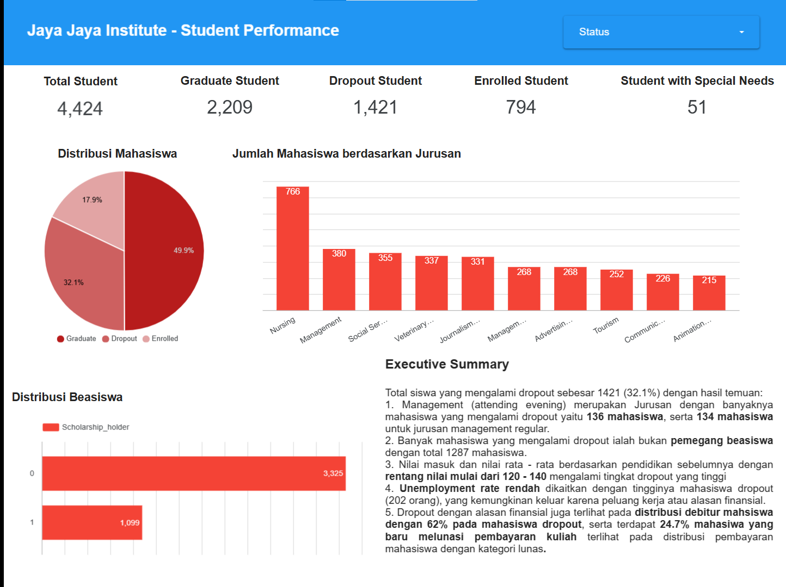
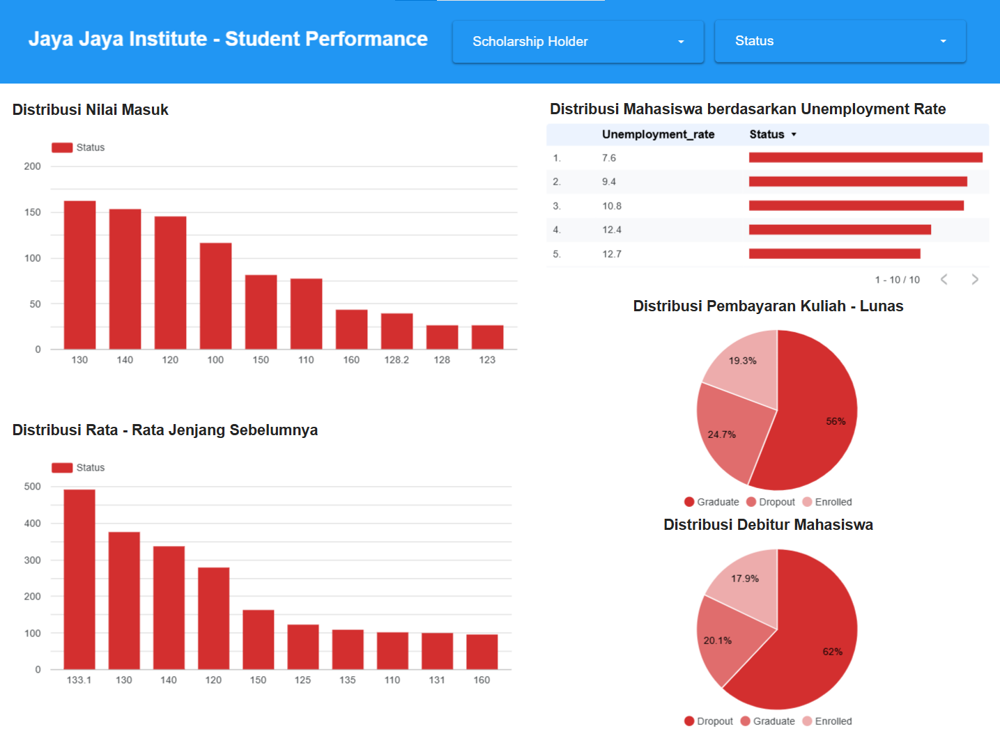

# Proyek Akhir: Menyelesaikan Permasalahan Perusahaan Edutech

---

## Business Understanding

Jaya jaya institute merupakan salah satu institusi perguruan yang telah berdiri sejak tahun 2000. Hingga saat ini, telah banyak lulusan yang berhasil tercetak dengan reputasi yang sangat baik. Akan tetapi, terdapat banyak juga siswa yang tidak mampu menyelesaikan pendidikannya alias _dropout_.

### Permasalahan Bisnis

Tingkat droput yang tinggi di Jaya Jaya Institut mengindikasikan adanya suatu tantangan dalam mempertahankan siswa hingga siswa tersebut lulus. Dengan total dropout yang tercatat hingga 32.1% atau sebanyak 1421 siswa. Hal ini dapat mengakibatkan penilaian reputasi institusi menjadi buruk, efisiensi operasional terganggu, serta kepercayaan masyarakat terhadap kualitas dari Jaya Jaya Institute.

### Cakupan Proyek

Cakupan proyek yang akan dilakukan antara lain:

1. Analisis Data Mahasiswa
2. Membangun Model Machine Learning Prediktif untuk mendeteksi risiko dropout
3. Visualisasi data dan hasil prediksi dalam bentuk dashboard
4. Rekomendasi strategi pencegahan dan pembimbingan

### Persiapan

Sumber data:
Dataset diambil dari https://github.com/dicodingacademy/dicoding_dataset/blob/main/students_performance/data.csv

Dataset ini berisi informasi tentang mahasiswa dari berbagai program studi di institusi pendidikan tinggi. Data mencakup faktor akademik, demografis, dan sosial-ekonomi pada saat pendaftaran, serta kinerja akademik mereka di akhir semester pertama dan kedua.

**Setup Environtment:**

Cara menjalankan prototype dapat dilakukan dengan:

1. Instalasi python dan library yang dibutuhkan atau dapat melakukan clone pada `https://github.com/margaretalola/penerapan-data-science_final-submission` menggunakan:

   `git clone https://github.com/margaretalola/penerapan-data-science_final-submission.git`

2. Jalankan perintah `pip install -r requirements.txt` untuk menginstall library. Jika terjadi error dapat menggunakan langkah berikut

   ```
   pip install --upgrade pip
   pip install -r requirements.txt
   ```

---

## Business Dashboard

Link Akses :
https://lookerstudio.google.com/s/hwZfrsYrixI

Dashboard ini menyajikan data performa mahasiswa Jaya Jaya Institute dengan fokus pada analisis status mahasiswa (Graduate, Dropout, Enrolled), faktor-faktor yang memengaruhi dropout, dan distribusi berdasarkan atribut akademik dan finansial.

Ringkasan Utama:

- Total Student: 4,424
- Graduate Student: 2,209
- Dropout Student: 1,421 (32.1%)
- Enrolled Student: 794
- Student with Special Needs: 51



Pada Distribusi Status Mahasiswa, terlihat lebih dari sepertiga mahasiwa tidak menyelesaikan studi mereka (32.1%).

Jurusan dengan dropout terbanyak adalah:

- Management (Evening): 136 mahasiswa
- Management (Reguler): 134 mahasiswa

Jurusan lain dengan angka mahasiswa cukup tinggi:

- Nursing: 766 mahasiswa
- Social Services dan Veterinary juga cukup signifikan

**Untuk Distribusi Beasiswa**, hanya 1099 mahasiswa adalah penerima beasiswa, sedangkan 3,325 mahasiswa tidak mendapat beasiswa. Tingkat dropout lebih tinggi ditemukan pada **mahasiswa yang tidak menerima beasiswa.**



Dashboard juga menunjukkan bahwa jumlah mahasiswa dropout cukup tinggi bahkan di daerah dengan tingkat pengangguran rendah. Contohnya, pada daerah dengan unemployment rate 7.6%, terdapat 202 mahasiswa yang keluar.

Interpretasi:

- Mahasiswa dari wilayah dengan peluang kerja yang lebih baik cenderung keluar dari pendidikan karena langsung mendapat pekerjaan.
- Faktor ekonomi juga berperan—sebagian mahasiswa mungkin tidak mampu secara finansial untuk melanjutkan studi dan memilih bekerja penuh waktu.
- Ada indikasi bahwa kurangnya keterkaitan antara pendidikan tinggi dan kebutuhan industri membuat mahasiswa merasa lebih efisien untuk langsung bekerja.

**Distribusi Nilai Masuk & Jenjang Sebelumnya**
Data menunjukkan bahwa mayoritas mahasiswa yang mengalami dropout berada pada rentang nilai masuk 120–140, yang mengindikasikan bahwa tingkat kemampuan akademik awal yang rendah berkontribusi terhadap risiko dropout. Selain itu, jika dilihat dari nilai rata-rata jenjang sebelumnya, sebagian besar mahasiswa dropout berasal dari latar belakang dengan nilai antara 130–133.1. Hal ini memperkuat dugaan bahwa penurunan performa akademik sejak awal pendidikan tinggi menjadi faktor pemicu mahasiswa untuk keluar sebelum menyelesaikan studi.

**Faktor Finansial**
Faktor ekonomi juga memainkan peran penting dalam keputusan mahasiswa untuk dropout:
Sebanyak 24.7% mahasiswa dropout belum melunasi biaya kuliah, dan 19.3% lainnya masih memiliki cicilan aktif. Ini mengindikasikan bahwa kesulitan membayar biaya pendidikan menjadi hambatan signifikan dalam keberlangsungan studi. Lebih lanjut, 62% dari mahasiswa dropout tercatat memiliki status sebagai debitur, jauh lebih tinggi dibandingkan 20.1% mahasiswa lulusan dan 17.9% mahasiswa aktif (enrolled). Data ini memberikan bukti kuat bahwa tekanan finansial merupakan faktor utama penyebab mahasiswa menghentikan studi mereka.

---

## Menjalankan Sistem Machine Learning

Setelah melakukan close dan install requirements.txt serta segala hal yang diperlukan, dapat langsung menjalankan perintah `streamlit run app.py` atau dapat mengakses link: https://finalsubmissionpds-margaretalola.streamlit.app/ untuk meninjau langsung prototype

---

## Conclusion

Dari analisis data mahasiswa di Jaya Jaya Institute, ditemukan bahwa angka dropout cukup signifikan, mencapai 32.1%. Hasil visualisasi dan prediksi menggunakan model machine learning menunjukkan bahwa dropout dipengaruhi oleh kombinasi faktor akademik dan ekonomi.

Mahasiswa dengan nilai akademik awal yang rendah serta rata-rata nilai dari jenjang sebelumnya yang kurang memadai memiliki risiko lebih tinggi untuk dropout. Selain itu, kesulitan dalam membayar biaya kuliah, status sebagai debitur, dan terbatasnya akses terhadap beasiswa semakin memperberat tekanan finansial yang menyebabkan mahasiswa tidak dapat menyelesaikan studi mereka.

Selain faktor akademik dan ekonomi, peluang kerja yang tinggi di daerah asal mahasiswa juga menjadi dorongan utama bagi mereka untuk meninggalkan pendidikan lebih awal dan langsung masuk ke dunia kerja.

Model machine learning yang telah dikembangkan mampu mengidentifikasi mahasiswa yang berisiko mengalami dropout secara dini, baik menggunakan input file .csv dari data mahasiswa maupun menggunakan input manual untuk meninjau data personal milik mahasiswa tersebut. Dashboard interaktif yang tersedia membantu para pemangku kepentingan dalam memahami faktor utama yang berkontribusi terhadap dropout, serta mendukung pengambilan keputusan yang lebih efektif.

---

### Rekomendasi Action Items

**Program Intervensi Akademik Dini**

Lakukan pembinaan khusus untuk mahasiswa dengan nilai masuk rendah, termasuk program mentoring dan remedial learning, agar mereka dapat menyesuaikan diri dengan tuntutan akademik sejak awal.

**Perluasan Program Beasiswa & Bantuan Keuangan**

Tingkatkan jumlah penerima beasiswa serta perluas program keringanan biaya untuk mahasiswa dengan status debitur dan cicilan, guna mengurangi beban finansial yang berujung pada dropout.

**Integrasi Prediksi Risiko Dropout ke Sistem Akademik**

Terapkan sistem peringatan dini berbasis machine learning untuk mendeteksi mahasiswa berisiko tinggi agar bisa diberikan intervensi secara proaktif.

**Kemitraan dengan Industri untuk Program Magang Berbasis Studi**

Arahkan peluang kerja ke dalam bentuk magang terintegrasi dengan studi, sehingga mahasiswa tidak perlu meninggalkan pendidikan demi pekerjaan penuh waktu.
